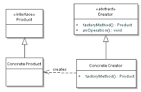
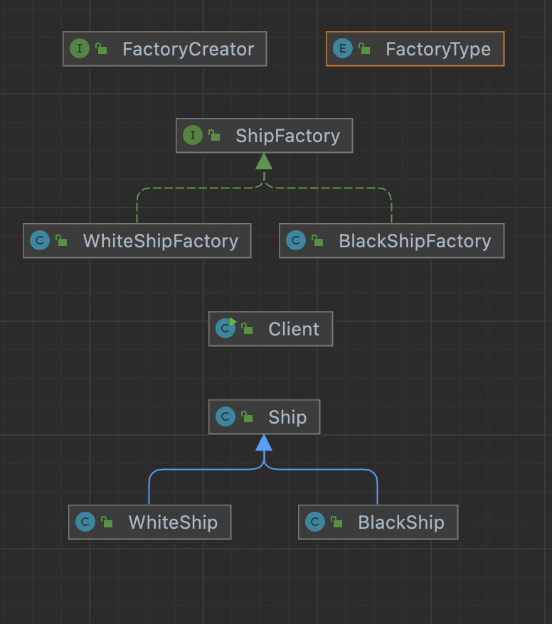

# Factory Method

</br>

|                       UML                       |
| :---------------------------------------------: |
|  |

</br>

- Java 8부터 interface에 default 메소드
- Java 9부터 interface에 private 메소드 추가
- interface에 pulblic 명시 안해줘도 되는 이유

</br>

> 구현체를 생성하기 위한 인터페이스를 정의 하고,  
> 어떤 클래스의 인스턴스를 생성할 것인지 처리해주는 디자인 패턴

</br>

- story

</br>

> 흰배를 만드는 공장이 너무 잘돼서 추후에 검은 배를 만들기로 했다.  
> 처음에는 쉽팩토리에 흰배와 검은 배를 분리하여 생선하는 로직.  
> 그러나 생성과 비즈니스 로직이 너무 몰려있고,  
> 두 개의 타입일 때는 그나마 낫지만 빨간색 배는? 남색 배는?

</br>

- 장점

> 클래스의 `생성과 비즈니스 로직을 분리`하여 클래스간의 직접적인 의존도를 낮출 수 있다는 장점.  
> 하나의 클래스가 `직접 객체를 생성하는 것을 방지`하고  
> `생성 관련 로직을 담당하는 클래스에게 위임` 하는 것.

</br>

- 단점

> 구조가 커질 수록 하위 클래스의 재정의로 클래스 수가 늘어난다...

</br>

- 예제 코드 및 다이어그램

</br>



</br>

> 1. Client는 Factory 선택한다(Enum Type)
> 2. EnumType을 받은 `FactoryCreator`는 각 선택에 맞는 factory의 instance를 생성한다.
> 3. 각 factory는 공장에 맞는 배를 만들고 서비스를 제공

</br>

</br>

```java

// 1. 팩토리 타입 선택 하여 팩토리 제공

public interface FactoryCreator {

    static ShipFactory getInstance(FactoryType type){
        switch (type){
            case WHITE:
                return new WhiteShipFactory();
            case BLACK:
                return new BlackShipFactory();
            default:
                throw new IllegalArgumentException("그런 공장은 없다!");
        }

    }
}

```

```java

// 2. Client가 선택, Client가 어떤 타입이 있는지 모를 경우 에러 처리 해주고, 또한 Client 단에서 인스턴스를 생성하는 책임을 지우게 하기 싫었음.

public class Client {
    public static void main(String[] args) {

        ShipFactory shipFactory = FactoryCreator.getInstance(FactoryType.BLACK);
        print(shipFactory.orderShip("BlackShipByjung","jkixxx@hufs.ac.kr"));

    }

    private static void print(Ship ship){
        System.out.println(ship);
    }
}

```

```java

// 3. 추상체인 ShipFactory를 Client에 뿌리면서 White 및 Black Factory 이후에 다른 공장이 추가되어도 확장에 용이

package jung.whiteship.designpatterns._01_creational_patterns._02_factory_method;

public interface ShipFactory {

    default Ship orderShip(String name, String email){
        validate(name,email);
        prepareFor(name);
        Ship ship = createShip();
        sendMailTo(email,ship);
        return ship;
    }

    private void prepareFor(String name){
        System.out.println(name + "을 만들 준비 중...");
    };

    void sendMailTo(String email, Ship ship);

    Ship createShip();

    private void validate(String name, String email){

        if(name == null || name.isBlank())
            throw new IllegalArgumentException("이름을 적어주세요.");

        if(email == null || email.isBlank())
            throw new IllegalArgumentException("이메일을 적어주세요");
    }

}

```

## 정적 팩토리 메서드

</br>

- 다시 찾아보게된 이유

</br>

> `FactoryCreator의 getInstance` 함수를 보면 정적 메소드로 정의 한 것을 볼 수 있다.  
> 사실 개인적으로 정적 메소드로 정의 하지 않으면  
> 클라이언트에서 특정 공장을 new 해서 생성하는게 찝찝했다.

</br>

- 객체 생성을 캡슐화하고 은닉화 할 수 있다.
- 생성의 책임을 아예 외부로 빼주는 방법

</br>

- 정적 팩토리 메서드 네이밍 컨벤션

</br>

|                           |                                                     |
| :-----------------------: | :-------------------------------------------------: |
|           from            |        하나의 매개 변수를 받아서 객체를 생성        |
|            of             |        여러개의 매개 변수를 받아서 객체 생성        |
| getInstance 혹은 instance | 인스턴스를 생성. 이전에 반환했던 것과 같을 수 있다. |
|         get(type)         |             다른 타입의 인스턴스를 생성             |
|      new(otherType)       |          다른 타임의 새로운 인스턴스 생성           |
