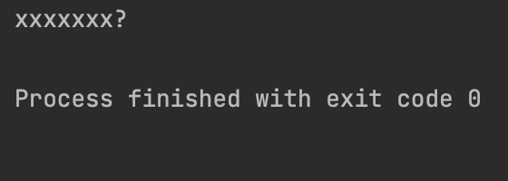

# Singleton

## **(싱글톤 패턴)Singleton pattern**

---

</br>

> 단 한 번 객체를 생성하여 `인스턴스`를 메모리의 할당한 후  
> 객체 생성 없이 인스턴스를 참조하여 사용하는 디자인 패턴

</br>

|                                       |
| :-----------------------------------: |
|  |

## 구현 방식

</br>

### Eager Initialization (thread-safe)

```java

// Eager initialization
public class GameSetting1 {

    private static final GameSetting1 INSTANCE = new GameSetting1();

    private GameSetting1(){}

}

```

</br>

> 객체 생성이 비싸지 않고, 무조권 사용된다는 보장이 있다면 적합하지만  
> 기본적으로 static 변수기 때문에, 인스턴스를 사용한다는 보장이 없다면  
> 효율적인 방법은 아니다.

</br>

### Lazy Initialization (thread-safe X)

</br>

```java

// if 이용 Lazy Initialization
public class GameSetting2 {

    private static GameSetting2 instance;

    private GameSetting2(){}

    public static GameSetting2 getInstance(){
        if(instance == null)
            instance = new GameSetting2();

        return instance;
    }
}

```

</br>

> if문을 사용하여 instance가 없다면 생성하는 방식  
> 동기화 문제가 발생할 수 있는 곳에서 lock을 하지 않고 사용한다면  
> 단 하나의 인스턴스를 보장하지 못할 수 있다.

### Synchronized

</br>

```java

// Synchronized
public class GameSetting3 {

    private static GameSetting3 instance;

    private GameSetting3() {}

    public static synchronized GameSetting3 getInstance(){
        if(instance == null)
            instance = new GameSetting3();
        return instance;
    }
}

```

</br>

> getInstance함수에 synchronized 블럭을 하여 임계 구역 문제를 해결한 방식  
> 함수 자체에 synchronized로 감쌀 경우 lock의 범위가 커져 프로그램의 퍼포먼스가 떨어진다.  
> 또한 instance가 null일때도 우선적으로 lock이 일어나기 때문에 좋은 방법 X

</br>

### Double checking

</br>

```java

// Double checking
public class GameSetting4 {

    /*
    * volatile 키워드는 메인메모리에 저장하여 사용하는 방식
    * 당연히 메인메모리를 직접 읽어오고 사용하는 방식은 성능상 불리
    */
    private static volatile GameSetting4 instance;

    private GameSetting4() {}

    public static GameSetting4 getInstance(){

        if(instance == null){
            synchronized ((GameSetting4.class)){
                if(instance == null)
                    instance = new GameSetting4();
            }

        }
        return instance;
    }

}

```

</br>

> synchronized를 instacne가 null일때만 감싸 기존 방식의 개선 방식  
> 부분 개선책

### Holder innerClass

</br>

```java

// inner class
public class GameSetting5 {

    private GameSetting5(){}

    private static class GameSettingHolder{
        private static final GameSetting5 SETTINGS = new GameSetting5();

    }

    public static GameSetting5 getInstance(){
        return GameSettingHolder.SETTINGS;
    }

}

```

</br>

> 내부에 inner class를 두고 instance를 생성하는 가장 권장되는 방식 중 하나

</br>

- inner class를 사용하는 이유

</br>

> GameSetting가 로드 될때 static 필드와 함수는 초기화 지정으로 선정된다.  
> 그러나, `내부 클래스가 static이라 할지라도 초기화 대상에 포함 되지 않기 때문`에,  
> getInstance()가 호출 되고 나서 메모리에 로드하고 인스턴스 생성된다.

</br>

> 위의 모든 방법은 reflection과 직렬화의 취약하다.

</br>

- reflection

```java

public class Main {

    public static void main(String[] args) throws NoSuchMethodException, InvocationTargetException, InstantiationException, IllegalAccessException {

        // Holder innerClass 사용
        GameSetting5 instance = GameSetting5.getInstance();

        Constructor<GameSetting5> constructor = GameSetting5.class.getDeclaredConstructor();
        constructor.setAccessible(true);

        GameSetting5 instance2 = constructor.newInstance();

        if(instance == instance2)
            System.out.println("게임 설정의 인스턴스는 같아요!");
        else
            System.out.println("xxxxxxx?");

    }

}

```

</br>

|     reflection로 단일 instacne 보장 깨트리기      |
| :-----------------------------------------------: |
|  |

</br>

> reflection은 class 내부의 접근제한자의 권한을 무너뜨려 억지로 사용하는 방법이다.
> 얼마든지 Client가 깨뜨릴 수 있는 구조.

</br>

- 직렬화

</br>

> 직렬화 역직렬화는 대응이 가능하지만 몇몇 취약한 점들이 있다.  
> Serializable interface를 상속 받은 후 readResolve 메서드를 통해  
> 동일 인스턴스를 보장하는 방법. -> 사용자가 신경써야할 코드

</br>

### Enum

```java

// enum type
public enum GameSetting6 {

    INSTANCE;
}

```

</br>

> enum은 기본적으로 java.lang.Enum을 상속 받고  
> Enum이 Serialzable을 상속 받음.  
> 리플렉션으로 뚫리지 않아 인스턴스를 보장
>
> enum 방식은 미리 만들어지고,  
> enum class는 다른 class를 상속 받을 수 없다.  
> -> Enum을 이미 상속 받고 있기 때문(interface는 가능하다~)

</br>

### 싱글톤 문제

> 우선적으로 싱글톤은 구현체로 싱글톤 클래스를 사용하는 클래스와의 의존도가 높다.  
> static 함수는 전역적으로 사용할 수 있기때문에 마구잡이로 write(변경)할 경우  
> 어디서 잘못 사용되는지 알기 어렵다.  
> private 생성자는 단일 인스턴스를 보장하기 위해 사용하지만 유연성을 떨어뜨리는 문제도 발생시킴.  
> read(읽기) 그리고 고정적인 연산만을 호출하여 리턴받는 설정 파일이라면 적합.

</br>

```java
// 잘못된 예

@Getter
@Setter
public class WrongGameSetting {

    private String KeySetting;
    private String os;

    private WrongGameSetting(){}

    private static class WrongGameSettingHolder(){
        private static final WrongGameSetting SETTING = new WrongGameSetting();
    }

    public static WrongGameSetting getInstance(){
        return WrongGameSettingHolder.SETTING;
    }

}

```

</br>

> Setter 설정 권한을 주어 프로퍼티를 자유롭게 설정할 수 있는 나쁜 예

</br>

```java

public class Main2 {
    public static void main(String[] args) {

        WrongGameSetting instance1 = WrongGameSetting.getInstance();
        WrongGameSetting instance2 = WrongGameSetting.getInstance();

        instance1.setKeySetting("Standard");
        instance1.setOs("Mac");

        instance2.setKeySetting("Custom");
        instance2.setOs("Windows7");

        // ???????????
        System.out.println(instance1.getKeySetting()
                +"\n" + instance2.getOs());

    }
}

```

</br>

> 만일 위와같은 상황에서 구조가 커질 때  
> 어디서 문제가 발생했는지 알기 힘들다. (IDE 도움 받아서 다 찾는 수 밖에?)
> 찾아내도 설정을 바꾸어서 이미 다른 class가 사용해 버린 경우??
